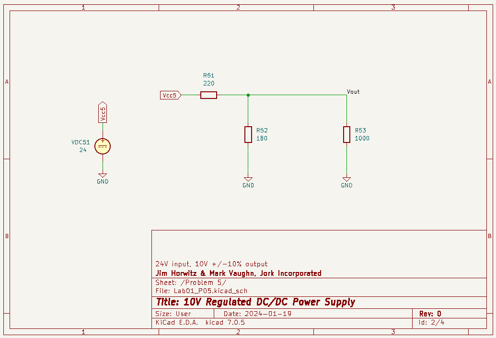
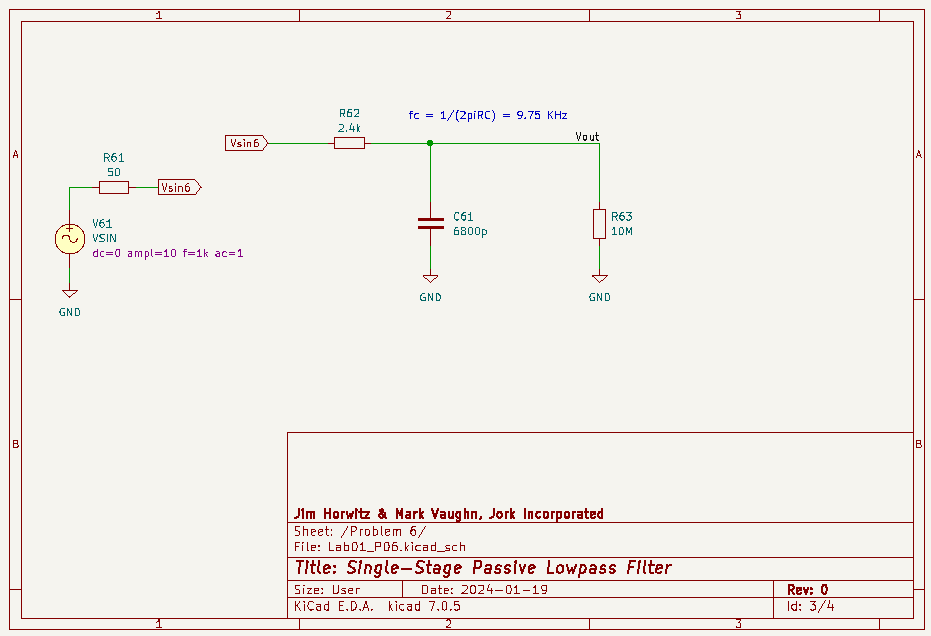
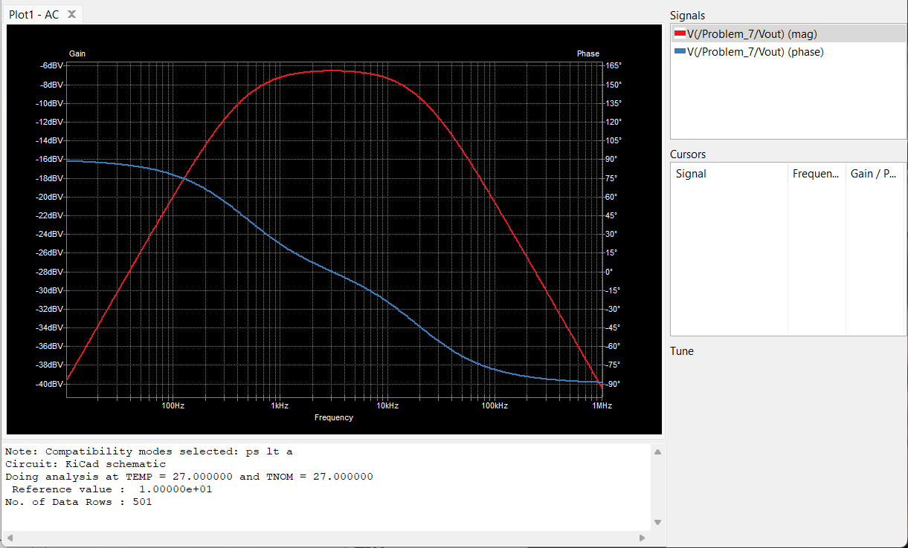

# Lab 1 Saturday Schematic
Jim Horwitz and Mark Vaugh
Jork Incorporated

### Q5
Derived by taking the thevenin equivalent of the no load circuit with V_th specified as the no load output voltage - we chose a max of 10.5V to ensure we were in spec for the 10 +/- 10% source.

Then v_out with a voltage divider was created using V_th, the 1k load, and a v_out of our 9.5V minimum threshold.

We didn't take into consideration the 1/4W limits on the resistors, and are aware that were over wattage on our component selections.

Figure 1: Q5 Saturday Schematic

Figure 2: Q5 Saturday Sim

### Q6
Parts spec'ed per recommendation of assignment

Figure 3: Q6 Saturday Schematic

Figure 4: Q6 Saturday Sim

### Q7
Loading of first stage not considered per recommendation from problem. Both stages were designed independently and then combined together.

Figure 5: Q7 Saturday Schematic

Figure 6: Q7 Saturday Sim

