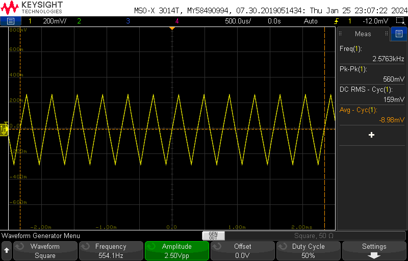

# Lab 1 #

Mark Vaughn and Jim Horwitz  
_Answers in italics_

## Q1 ##

**How much current flows in the leads of an ideal voltmeter?**  _None_  

**How much voltage appears across the leads of an ideal current meter?** _None_  

**A bench power supply contains a voltmeter and an ammeter. Are both these meters accurate when you are interested in accurately measuring the voltage and current at a load that you have connected to the bench power supply with test leads? Elaborate.**  _The built in voltmeter & ammeter cannot both be accurate. From the answers to the above questions, it is clear that a bench power supply can't be an ideal voltmeter when it is sourcing current, and it can't be an ideal ammeter when it is supplying voltage. Since a bench power supply is doing both under normal operating conditions, both meters inside of a power supply will have some inaccuracy._  

## Q2a ##

**5 two-wire resistance readings for a 0.12 Ohm, 5% resistor:**  _[1.1, 2.8, 3.3, 1.3, 1.5]_ $\Omega$ 

**What do you observe, and what is causing the variation in the readings?**  _There is a large variation in the measurements we received. Each time we plug in the cable, a different contact occurs leading to a different voltage drop and different output resistance._  

## Q2b ##

**5 four-wire resistance readings for a 0.12 Ohm, 5% resistor:**  _[0.26, 0.30, 0.26, 0.20, 0.18]_

**How do the results in 2(a) and 2(b) compare?** _2b is significantly more accurate than 2a_

**Which technique is better and why?**  _4-wire is better as it is more accurate._

**What is the concept behind four-wire measurement, and what problem does it overcome?**  _4-wire measurements overcome the additive resistance in the cables connecting the resistance to be measured to the DMM. It does so by separating the current source leads from the voltage measurement leads. Since the cables connecting the sense wire aren't sourcing or sinking any current, there is no voltage drop across the cables which leads to a more accurate measurement._

**Define "Repeatability" and "Resolution":** 
_"Repeatability" is a measurement of how easy it is to replicate results. Resolution is the scale at which the results can be measured, (eg bitrate)_  

**Define "precision" and "accuracy":**  _"Precision" is a description of the resolution or exactness of a measurement. In the case of our Hewlett Packard bench DMM, the precision of any measurement is 6 1/2 digits (assuming a stable reading). "Accuracy," on the other hand, describes how close a measurement is to a standardized or agreed-upon "correct" value._  

## Q3a ##
R = $9.76 \Omega$

**Prepare a graph of the I-V forward characteristics of a 1N4148 diode. Include a fixed series resistor to provide current limiting and adjustment.**  

_See Figure [x]_  

**How many significant digits do you think it is appropriate to record?**  _The diode has a max forward voltage of 1V, so a precision of 2 decimal places is appropriate to record._  

**What would be an appropriate current range to graph?**  _looking at the datasheet, the absoluate average current rating is 150mA, so a range of 0-150mA would suffice_  

**Determine the series resistance of the diode.**  
<!-- _GREAT QUESTION, LARRY! AS A FUNCTION OF VOLTAGE?_   -->

## Q3b ##

**Measure and record the internal resistance of a AA battery:**  
_**AA 1:**_  
Open Circuit (OC) Voltage of 1.42V  
1V across $1 \Omega$ resistor  
Internal Series Resistance (ISR) of $0.42\Omega$

_**AA 2:**_  
OC Voltage 1.44V  
1.04V across $1 \Omega$  
ISR of $0.4 \Omega$  

**How do you think the internal resistance of a battery relates to its physical size, output current capability, capacity, and state-of-charge?** _The larger the path for charge carriers to flow (i.e. larger cell size), the lower internal series resistance, higher output current, and higher capacity the battery will have. The larger the size of the battery will also make state-of-charge decrease slower._

**How do you think the internal resistance of a 9 V transistor-radio battery would compare to that of the AAA and AA batteries?** _9V batteries are larger, but are constructed of 6 smaller LR61 cells in series. Therefore, 9Vs have a lower output current and greater internal resistance than the AAA/AA counterparts._  

## Q3c ##

**A flashlight with a PR-6 incandescent lamp would use two AA cells in series. However, the PR-6 lamp is rated at 2.47 volts, not 3.0V. Why?** _As the AA cells source current, the ISR of the AAs will drop the additional 0.53 volts necessary to efficiently power the PR-6 lamp._

## Q4 ##

Powered by 20VDC bench supply,

20 - 14 = 6V across resistor  
3.8W -> 270 mA through resistor  
R = 22 $\Omega$ -> 22 $\Omega$

**Provide the lamp-current waveform:**  

_See Figure [x]_  

**What is the source for the trigger signal?** _Signal will be triggered on the lamp passing current whlie in a low resistance, no light emitted mode._  

**Record the rise time of the current waveform:**  _300ms_  

**What lamp characteristic causes the current waveform to take this shape?** _when the filament in the lamp heats up, it increases in resistance, causing less current to flow through_  

**Calculate the required power rating of the resistor for continuous, steady-state operation.** _270mA through resistor, 6V drop means a power of 1.65W._  

**In your circuit, what is the resistor's maximum instantaneous power dissipation and when does it occur? Do you think the resistor you have chosen would provide reliable long-term operation?** _Instantaneous power dissipation occurs right when power is applied, where the resistor sees 15V instead of 6V and dissapates 4W. The resistor we've chosen will not provide reliable long-term operation._  

## Q5 ##

**What practical considerations should you keep in mind when determining the magnitude of these components (what are the compromises and penalties)?** _Lower resistor values will lead to higher max output current and more power distributed to the load, but at the cost of a higher runtime current, more heat lost, and worse ripple rejection. A higher resistance is the inverse, improved ripple rejection, lower runtime current, and less heat lost at the cost of worse max output current performance and less power distributed to the load_

<!--  -->
Figure [x]: Voltage divider schematic

## Q6 ##

_Our filter's cutoff frequency is 10.6 KHz._

_We chose a 6.8k resistor in order to prevent loading the generator more than 1%._  

_We then chose a 2.2nF capacitor to achieve a cutoff frequency close to 10KHz._

Figure [x]: Schematic for your Saturday Schematic.

Figure [x]: Bode Plot of LPF

## Q7 ##

Figure [x]: RC Band Pass Schematic

## Q7a ##

**Using the simulated frequency-domain plot, determine the center-frequency of the bandpass filter.**  _The simulated center frequency is 3.5 KHz._

**Calculate and record the Q of the filter.**  _Q = Fc/BW = 3.5KHz/(10KHz - 1KHz) = 0.4_  

## Q7b ##

**Does it matter which filter, the low-pass or the high-pass, is placed first in your circuit? Investigate this with CircuitLab and explain.**  _Placing the high-pass filter first attenuates the signal significantly more due to the increase in impedance (to prevent loading the high-pass stage) leading to higher resistive losses in the low-pass filter stage._

## Q7c ##

Figure [x]: Bode Plot of RC Bandpass

## Q7d ##

**How close did your breadboard match the simulated results? Record your observations.**  _Our breadboarded filter matched the simulated results very closely until the frequency exceeded 1MHz, at which point the ESR of the capacitors led to an increase in amplitude and a deviation from -90 degrees._

## Q8 ##

Figure [x]: Schematic of Parallel LC Resonant Passband Filter.

Figure [x]: Plots of Parallel LC Resonant Passband Filter.

## Q8a ##

**Using the simulated frequency-domain plot, determine the center-frequency of the bandpass filter.**  
_4.5kHz_

**Calculate and record the Q of the filter.**  
_lower -3db down = 3.9kHz, upper -3db down = 4.7kHz, f_c = 4.5kHz_
_Q = 0.178_

## Q8b ##

**Breadboard your circuit. After performing a quick time-domain check with the oscilloscope (input versus output), perform a Frequency Domain Plot of your breadboarded circuit using the Frequency Response  Analysis (Bode Plot) feature of your oscilloscope.  Record the Bode plot.**  

Figure [x]: Bode Plot Output of Scope  

## Q8c ##

**How close did your breadboard match the simulated results?**  
_graphs are nearly identical!_

**Record your observations.**  
_Very close to similar; however, the curvature of the peak in the amplitude response is a bit asymetrical._

## Q8d ##

**How does the performance of this filter compare to that of the 2-stage RC bandpass filter in Problem 7?  Record and explain your observations.**  
_The Q of this BPF is significantlly improved over the RC BPF._

**What might explain the differences that you observe?**  
_series resistance, stray capacitance, stray inductance, etc_

## Q9 ##

Figure [x]: Differentiator Schematic

## Q9a ##

Figure [x]: Waveforms

**Be prepared to discuss waveforms and operation of the circuit. (Use the capacitor  “axiom”).**  
_Capacitor acts as a high pass filter, adding a zero to the filter around a low frequency. Low frequencies are dropped, while higher frequencies remain. Often times, this means that only the harmonics of a signal (eg square wave) are kept while the original signal is mostly destroyed._

## Q9b ##
<!-- 
**How does the output change shape as the duty cycle, frequency, and amplitude of the input are increased and decreased?**  
_GREAT QUESTION, LARRY!_   -->

Figure [x]: Output of Differentiator with changes in duty cycle, frequency, and amplitude

## Q9c ##

**What components of the input waveform is the filter passing?**  
_A differentiator is a high-pass filter, which means it accepts frequencies higher than its cutoff (the signal's AC component) while rejecting the frequencies lower than the cutoff._

## Q10 ##

Figure [x]: Scope Trace:

## Q10a ##

Figure [x]: Integration Schematic

## Q10b ##

**What is the relationship of  (average) DC output voltage vs duty-cycle and frequency of the input? In other words, how does the average DC voltage change with changes at the input?**  
_Frequency has no effect on the DC filtered voltage as the average voltage doesn't change. However, a higher frequency input wave will make the pk-pk ripple less, as the time that the capacitors are charging/discharging is shorter per cycle. As the duty cycle increases, the average DC voltage will also increase._

## Q10c ##

**How does the load affect the ripple?**  
_Load will make ripple worse as the capacitor filtering the input signal will discharge faster._

**DC output voltage vs load?**  
_The DC output voltage on average versus a load should stay the same, however the ripple may make it very unstable, so much so that its difficult to even characterize as DC._

**How would you define the value of a DC voltage that has ripple?**  
_Value +/- %ripple_

## Q10d ##

**What happens to the output when the input to your filter is the 1KHz, -3V to +3V square wave from Problem 10?**  
_Lower frequencies lead to worsened ideal integrator properties as the time constant is different._

**What can you conclude about the average value of a square wave or sinewave?**  
_If the square wave has a perfect 50% duty cycle, the average voltage will always be half of the pk-pk voltage. Sine waves are the same; with a voltage centered around half the pk-pk voltage of the wave._

## Q10e ##

**Select values for an integrator which will convert the 1KHz, -3V to +3V square wave to a reasonable sine wave.**  
$\tau = RC$,
_we first set the R value, then chose the C value for a $\tau$ of 250us_

**How can you improve the “quality” (harmonic distortion) of the sine wave?**  
_Filter out more of the harmonics in the frequency domain such that only one harmonic remains._

**What happens to the amplitude of the sine wave as its quality improves?**  
_Amplitude goes down_

-> missing this!!
Figure [x]: Demonstration of ripple quality improvement

## Q10f ##

**Thinking of the integrator as a filter, what components of the input waveform are being passed by the filter?**  
_The low frequency components of the input waveform are being passed, while the high frequency components are rejected._

## Q10g ##

**Try adding an integrator stage to improve the sine wave quality.  Keep the load the same. Why does adding the stage help?**  
_Adding a second stage will add a second pole into the circuit, making the rolloff of our filter double from -20db/decade to -40db/decade_

## Q11 ##

**Be sure that the current limit on your bench power supply is set to maximum.  Why?**  
_Set the current limit to maximum bc the transient current at the spike of the lamp will further emphasize the spike able to be used for the timing circuit._

-> missing this!!
Figure [x]: Schematic
