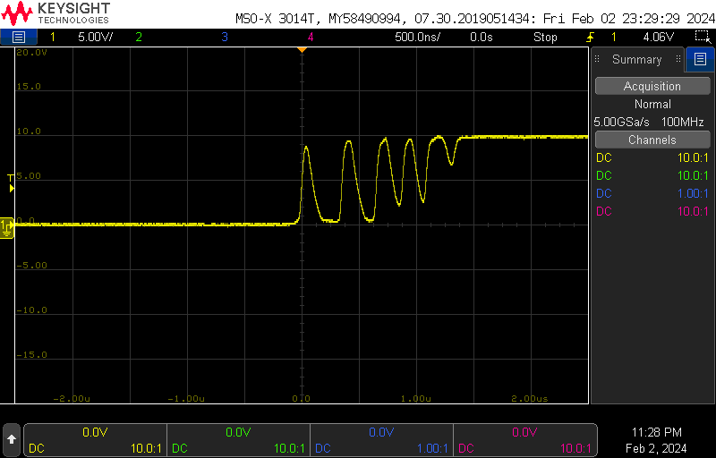
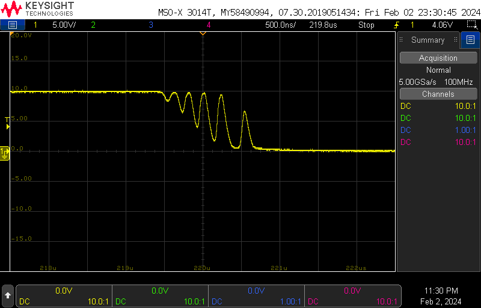
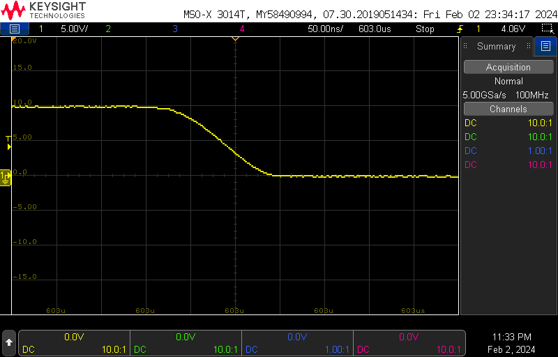
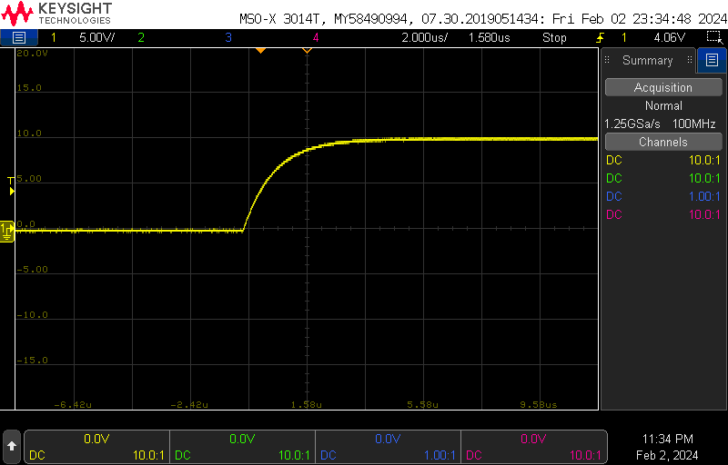

# Lab 3 #

Mark Vaughn and Jim Horwitz  

## 1A ##

**Are the transitions perfectly clean?** No, there are some nonidealities when zooming in at 500ns/div. We suspect this has to do with the comparator output loading the PSU and causing a slight drop in voltage, which messes with the thresholding value.

**47K Pullup** The 47k dampens the system because the output swings slower due to less current from the pullup. Rise and fall times are uneven because the circuit relies on the internals of the comparator to pull it down, where as the rising edge relies on current from the pullup.

**What happens to the duty cycle of the output waveform as the threshold voltage changes?** Duty cycle increases as threshold increases.

## 1B ##
