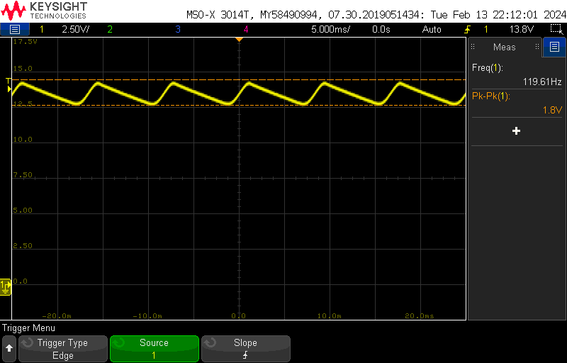
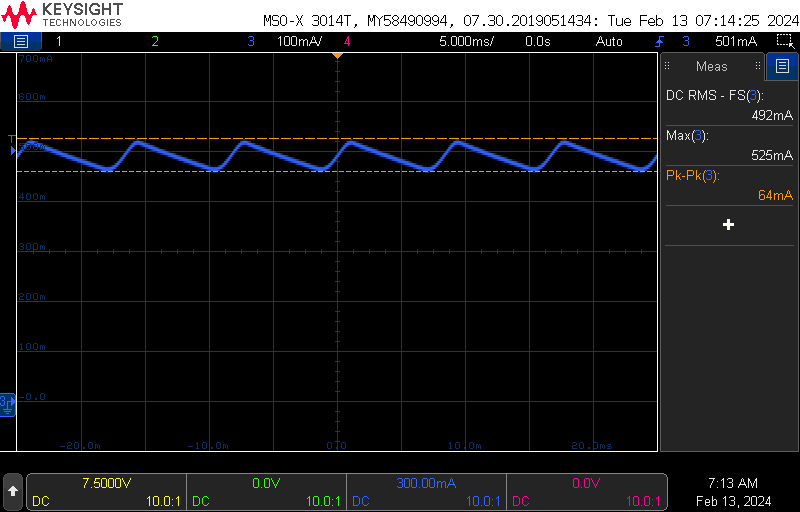
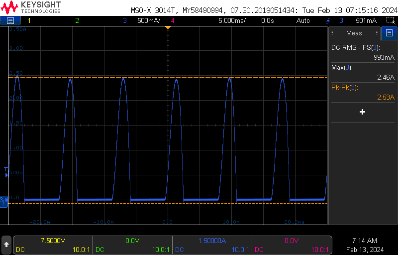
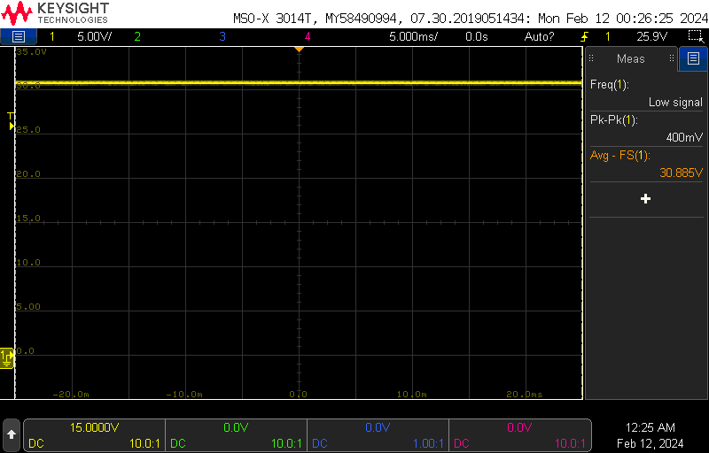
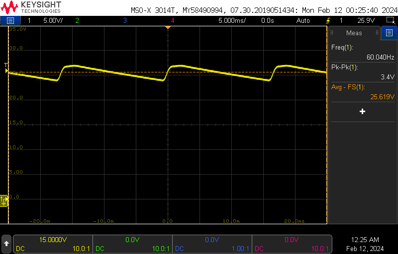
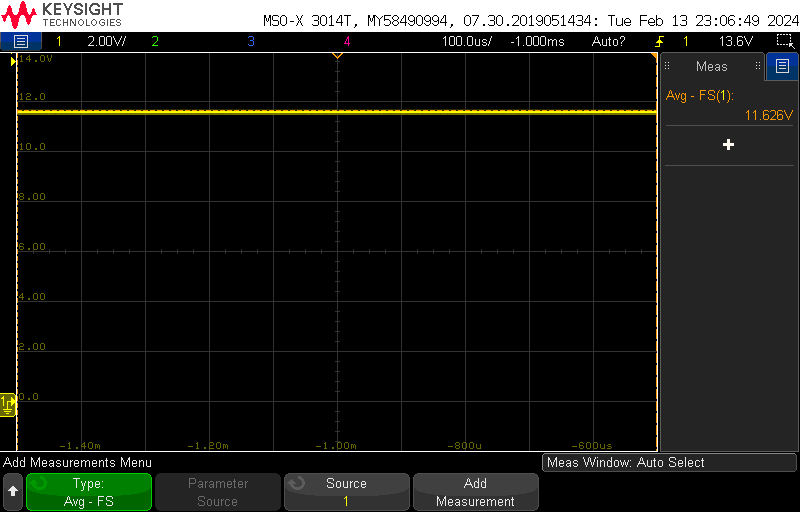
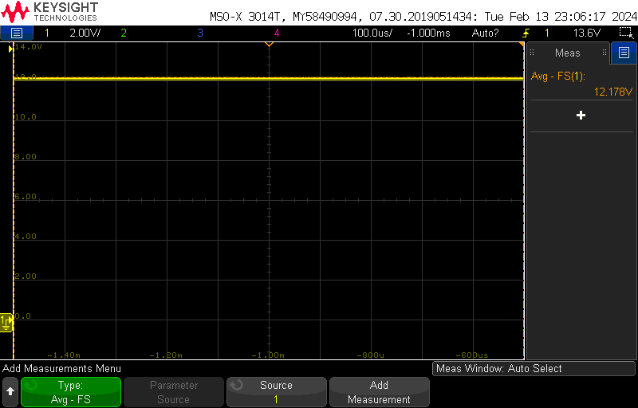
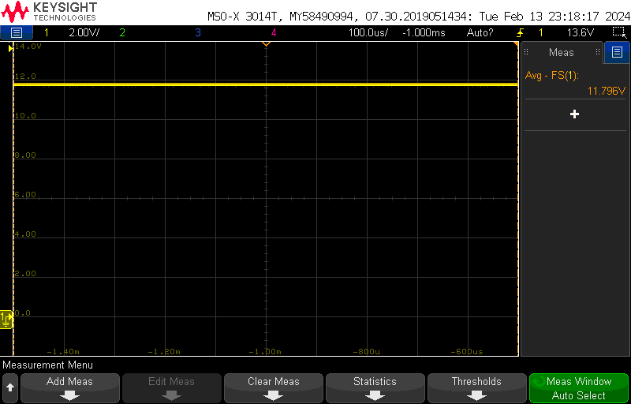
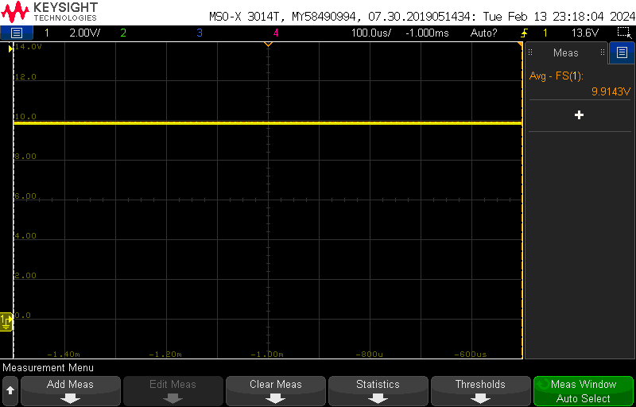

# Lab 4 
## Mark Vaughn and Jim Horwitz

### Part 1

**Average DC Output Voltage (FL)** 13.4VDC

**Average DC Output Current (FL)** 0.489ADC

**DC output Ripple Voltage (FL)** 1.8Vpkpk

**Filter capacitor peak and RMS current, point A** RMS: 492mA pkpk: 64mA

**Bridge rectifier output current, point B** RMS: 993mA pkpk: 2.46A

**Explain the waveforms seen at points A and point B; what is the difference between them?** The filter capacitor never fully discharges, and is always constantly dumping current into the load, thus the relatively consetant current through the filter capacitor. The lead from the diode to the capacitor only conducts when the AC supply is above the  capacitor voltage minus two diode drops. There is very little resistance from the source to the capacitor: just the ESR of the diodes, capacitor, wires, and series resistance of the source.

**How do you define “output voltage”? What causes the drop in output voltage as the load increases?** Output voltage can be defined as the voltage produced by a source at a given current value. That way, load regulation is accounted for. In more precise scenarios, multiple voltages at different currents can be provided. Output voltage drops as the load increases due to the internal series resistance of the source.

### Part 2

**Capacitor Selection** We used the period of the half cycle to spec the time constant with a resistor that amounts to full load and a droop/ripple 2VDC

**DC Output Voltage (NL)** 30.885VDC

**DC Output Ripple Voltage (FL)** 25.6VDC with 3.4Vpkpk ripple

### Part 3

**Calculate the maximum worse-case power dissipated in the Zener. Using the power derating curve from the data sheet, what is the maximum allowable operating ambient temperature for your circuit (under both load conditions, NL and FL)?** 876mW worst case dissipation. Roughly 77 deg. C worst case, 

**Change the input voltage to 15.0 VDC; record the output voltage of your circuit at no-load and full load. What is happening? Record your conclusion.**

At 15V, we don't have enough current going through the zener and we have hit the knee, indicated by the ~3v drop on the output.

**Change the value of resistor R1 so the circuit stays in regulation at full load when the input is 15.0VDC. Record the output voltage of the new circuit at no-load and full load. Calculate the maximum worse-case power dissipated in the Zener. Using the power derating curve from the data sheet, what is the maximum allowable operating ambient temperature for your circuit (under both load conditions, NL and FL)?** 1.08W worst case dissipation, . Barely works at limit; 50 deg C max unloaded. Loaded, 

**Use measurements of the circuit in B to determine the series resistance of the Zener.**

### Part 4